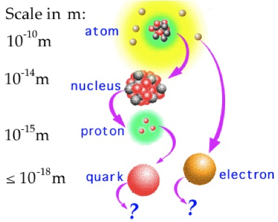
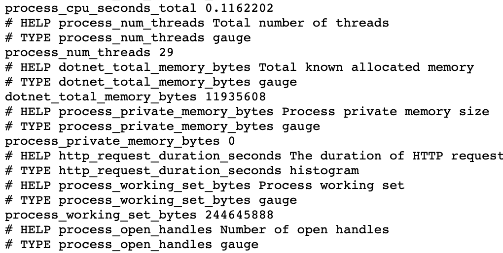
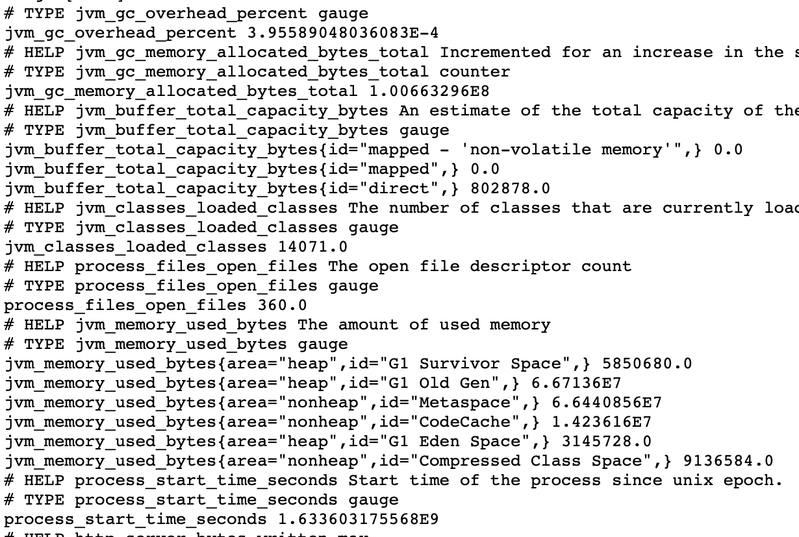
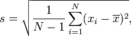

# Van microservices naar Quarkus

Door: Yael Bakker - [me@yael.fyi](mailto:me@yael.fyi)

[](https://github.com/Naereen?tab=followers)

Wij als ontwikkelaars vragen ons natuurlijk altijd af: kan het nóg efficiënter? (hoe minder werk, hoe beter)

Zoals agile begin 2001 op kwam in het methodiekenlandschap (Kooijman, 2016), zo kwam devops en microservices de afgelopen jaren op in de hands-on kant van ons vakgebied. Dit is allemaal leuk en aardig, maar: kan het dan nóg leaner?

TLDR; dat kan! Lees snel verder >>

> Als we een ander vakgebied bekijken, de natuurkunde, zie je over de loop der jaren ook steeds nieuwe ontdekkingen van groot tot letterlijk en figuurlijk heel klein. Waar in 1900, ver voordat software development in huidige vorm bestond, Prof. J.J. Thomson al schreef over 'bodies smaller than atoms' (Thomson, 1901) Gaat het momenteel o.a. over Quarks. Zonder op irrelevante details in te gaan: dit zijn deeltjes nóg kleiner dan atomen. Als het ware, de bouwstenen ván.



Quarkus is net zo iets als hierboven staat afgebeeld: het vormt de bouwstenen van een microservices architectuur. Een microservices architectuur geënt op Java dan wel niet te verstaan. Hoe dit in zijn werk gaat, wat de voordelen hiervan zijn én hoe je dit implementeert lees je in deze blogpost. Tevens geef ik je een aantal korte handvatten om zelf aan de slag te gaan met Quarkus in jouw project. Dit is een aanvulling op bestaande, [officiële handleidingen](https://quarkus.io/guides/getting-started). (QuarkusIO, 2021)

## Waarom Quarkus?

Quarkus is een framework, dat als voornaamste doel heeft Java centraler neer te zetten in de huidige docker-k8s cultuur. De voordelen die Quarkus biedt, zijn dan ook voornamelijk bruikbaar in containerized omgevingen. Gebruik je deze niet? Geen probleem. Dan kun je nog steeds gebruik maken (en voordeel hebben) van de meeste features van Quarkus.

Wil je quarkus gebruiken in je polyglot X micro-services-architectuur? Dit gaat makkelijk met behulp van [GraalVM](https://www.graalvm.org/), waar Quarkus ook ondersteuning voor biedt. (QuarkusIO, 2021) Op deze manier kun je als het ware een en dezelfde runtime image gebruiken voor al je micro-services.

## De voordelen van Quarkus

Quarkus adverteert met razendsnelle opstarttijden, laag geheugengebruik, near-instant scaling en AOT (Ahead Of Time) compilatie. Dit is relevant, omdat gangbare java JIT (Just In Time) compilatie gebruikt.

Een ander voordeel, wat ik als gebruiker van Quarkus direct merk, is dat er moeite is gedaan de 'user experience' zo vloeiend mogelijk te maken. Met dit bedoel ik uiteraard de ervaring voor ons als developers, aangezien wij de voornaamste gebruikers zijn. Dit is belangrijk, want lang niet alle (in mijn ervaring goede) frameworks zijn zo makkelijk te gebruiken als Quarkus.

Deel hiervan vormt een 'wrapper' om maven heen, in de vorm van een `mvnw` script. Verder biedt Quarkus veel standaardoplossingen voor problemen aan, in de vorm van third party libraries, zonder zichzelf dicht te timmeren. Er staat ook geregeld (in de officiële guides): "Wil je dit zelf liever met jouw favoriete tool doen? Dat kan!"

Om terug te komen op die performance winst: als we de eigen [site](https://quarkus.io) mogen geloven, zou gebruik van Quarkus zelfs meer dan 50% geheugenwinst, en meer dan 75% snellere opstarttijden op moeten leveren:


Dat stellen we zometeen graag zelf aan de kaak, a.d.h.v. een voorbeeldcasus.

## Quarkus in de praktijk

Genoeg tekst, laten maar eens wat gaan doen!

> Voor dit voorbeeld maak ik o.a. gebruik van [PitStop](https://github.com/edwinVW/pitstop). Een voorbeeldcasus van [InfoSupport](https://github.com/edwinVW/pitstop). Deze code-along is gebaseerd op bestaande guides die vrij beschikbaar zijn op [quarkus.io](https://quarkus.io/guides/).

### Aan de slag met Quarkus

Om een simpel project te starten (gebaseerd op Maven):

```sh
mvn io.quarkus.platform:quarkus-maven-plugin:2.3.0.Final:create \
    -DprojectGroupId=org.acme \
    -DprojectArtifactId=rest-json-quickstart \
    -DclassName="org.acme.rest.json.CustomerResource" \
    -Dpath="/customers" \
    -Dextensions="resteasy-jackson"
cd rest-json-quickstart
```

Deze applicatie start je vervolgens op met behulp van het `mvnw` script:

```sh
 ./mvnw compile quarkus:dev
```

### CustomerManagementAPI

Een van de services in de PitStop applicatie, is `CustomerManagementAPI`.

Als we het abstract bekijken, is `CustomerManagementAPI` slechts een microservice met 3 voornaamste functionaliteiten:

- REST API voor GET & POST /customers(/\<id\>)
- RabbitMQ aansluiting voor notificaties andere servies in de PitStop applicatie.
- Databeheer (authority) van 'Customers'

### CustomerManagementAPI in Quarkus

Om de scope van dit artikel beknopt te houden, houden we het voor nu even bij de eerste (en laatste als je in-memory data mee-telt) functionaliteit in bovenstaande lijstje.

Ten eerste een simpele, doch identieke `Customer` entity:

```java
public class Customer {
    public String customerId;
    public String name;
    public String address;
    public String postalCode;
    public String city;
    public String telephoneNumber;
    public String emailAddress;

    public Customer() {
    }

    public Customer(String customerId, String name, String address, String postalCode, String city, String telephoneNumber, String emailAddress) {
        this.customerId = customerId;
        this.name = name;
        this.address = address;
        this.postalCode = postalCode;
        this.city = city;
        this.telephoneNumber = telephoneNumber;
        this.emailAddress = emailAddress;
    }
}
```

Vervolgens een bijpassende `CustomerResource`:

```java
@Path("/customers")
public class CustomerResource {

    private Set<Customer> customers = Collections.newSetFromMap(Collections.synchronizedMap(new LinkedHashMap<>()));

    public CustomerResource() {}

    @GET
    public Response list() {
        return Response.ok(customers).build();
    }

    @POST
    public Response add(Customer customer) {
        try {
            customers.add(customer);
        } catch (Exception e) {
            return Response.serverError().build();
        }
        return Response.ok(customers).build();
    }
}
```

Om wat te zien als we `GET /customers` uit het endpoint opvragen voeg ik tot slot nog twee 'customers' toe:

```java
public CustomerResource() {
        customers.add(new Customer("1", "Johnny", "hoofdstraat 1", "5361AX", "Amersfoort", "0612345678", "johnny@example.com"));
        customers.add(new Customer("2", "Miep", "hoofdstraat 1", "5361AX", "Amersfoort", "0612345678", "miep@example.com"));
    }
```

### Prometheus

Om de geadverteerde performance-winsten te ervaren, kunnen we gebruik maken van Prometheus metrieken.

Voor het dotnet gedeelte van de applicatie (de originele `CustomerManagementAPI` van PitStop) is toevoegen van onderstaande code voldoende. Installeer wel eerst de [prometheus-net.AspNetCore](https://www.nuget.org/packages/prometheus-net.AspNetCore) nuget package.

Voegt dit toe aan `Startup.cs`

```c#
public void Configure(IApplicationBuilder app, ...)
        {
            ...
            app.UseRouting();
            app.UseHttpMetrics();
            app.UseEndpoints(endpoints =>
            {
                endpoints.MapMetrics();
            });
```

Voor de zojuist gemaakte Quarkus service is de volgende aanpak voldoende:

Installeer de `quarkus-micrometer-registry-prometheus` dependency door het volgende aan `pom.xml` toe te voegen:

```xml
<dependency>
      <groupId>io.quarkus</groupId>
      <artifactId>quarkus-micrometer-registry-prometheus</artifactId>
    </dependency>
```

Voeg vervolgens de volgende code toe aan `CustomerResource.java` (dependency injection):

```java
import io.micrometer.core.instrument.MeterRegistry;

@Path("/customers")
public class CustomerResource {

    @Inject
    MeterRegistry registry;
}

```

## Bevindingen

### Metingen

> Gebruik van resources op bestaande CustomerManagementAPI (Prometheus)



> Gebruik van resources op quarkus CustomerManagementAPI (Prometheus)



Response Tijden REST API calls:

| Request # | .net (ms) | quarkus (ms) |
| --------- | --------- | ------------ |
| 1         | 15.969    | 4.809        |
| 2         | 7.61      | 4.472        |
| 3         | 10.2515   | 25.8         |
| 4         | 17.019    | 10.6         |
| 5         | 52.588    | 7.62         |

Voor de mate van stabiliteit van deze metingen, kunnnen we snel even de standaarddeviatie (EduPristine, 2017) berekenen:



| .net (stddev, ms) | quarkus (stddev, ms) |
| ----------------- | -------------------- |
| 18.257            | 8.817                |

Lager = (in dit geval) stabieler.

Meer overtuiging heeft het niet nodig: quarkus is duidelijk sneller in dit geval.

\*\*Disclaimer: bovenstaande resultaten zijn onderhevig aan vele factoren, en dienen voornamelijk als anekdote over de beweerde perfomance winst van Quarkus. Werkelijk (reproduceerbaar) onderzoek is uiteraard beter opgezet (mag ik hopen).

### Containers

Voor de oplettende kijker: in onze werkmap, onder `/src/main/docker` staan ook enkele Dockerfiles met beschrijving. Deze zijn in principe klaar voor gebruik, en kunnen zo opgenomen wordden in een k8s of docker swarm omgeving.

Doe voordat je hier gebruik van maakt nog wel even: `./mvnw package`. Dit staat ook als commentaar in de Dockerfiles bijgevoegd en zou voor zich moeten spreken.

## En verder…

We hebben even kort gekeken naar Quarkus. Een microservices framework voor Java, met flinke claims betreft performance. Dit hebben we kort kunnen testen a.d.h.v. een voorbeeldapplicatie, waaruit bleek dat hier wel een kern van waarheid in zit.

Om dit zelf te ervaren, en meer te weten te komen over Quarkus, bevat de officiële documentatie vele guides die op, voor jou relevante, specifieke toepassingen in gaan.

Een (relevante) greep uit deze guides:

- [Generating Jax-RS resources with panache](https://quarkus.io/guides/rest-data-panache)
- [amqp](https://quarkus.io/guides/amqp)
- [deploying-to-kubernetes](https://quarkus.io/guides/deploying-to-kubernetes)

Verder is het volgende boek wellicht interessant (mochten boeken je ding zijn):

- Tayo Koleoso (August 26, 2020). Beginning Quarkus Framework: Build Cloud-Native Enterprise Java Applications and Microservices 1st Edition. Apress ISBN 1484260317.

## Bronnen

- Kooijman, B. (2021, 11 augustus). Wat is Agile? De betekenis van Agile werken. Agile Scrum Group. https://agilescrumgroup.nl/wat-is-agile/ Geraadpleegd op 7 oktober 2021.
- Thomson, J. J. & Smithsonian Institution. (1901). On Bodies Smaller Than Atoms. U.S. Government Printing Office. Geraadpleegd op 5 oktober 2021.
- Nordkvist. (2010). Scales of atoms to quarks [Illustratie]. http://portal.discoverthecosmos.eu/fi/node/93607[Attribution-NonCommercial-ShareAlike 3.0 Unported (CC BY-NC-SA 3.0)](https://creativecommons.org/licenses/by-nc-sa/3.0/) Geraadpleegd op 6 oktober 2021.
- Creating Your First Application. (z.d.). Quarkus.io. Geraadpleegd op 6 oktober 2021, van https://quarkus.io/guides/getting-started
- What is Standard Deviation and how is it important? (2018, 24 september). EduPristine. https://www.edupristine.com/blog/what-is-standard-deviation Geraadpleegd op 7 oktober 2021.

## Over de Auteur

Yael is een aankomend software developer aan de Hogeschool van Arnhem en Nijmegen. Verder heeft hij twee succesvolle bedrijfjes, en ruim 6 jaar aan relevante werkervaring in het vakgebied. In zijn vrije tijd is Yael vaak te vinden achter zijn espressomachine, waar hij krachtige shots espresso uit tovert, soms aangevuld met hippe melkschuimpatroontjes.


