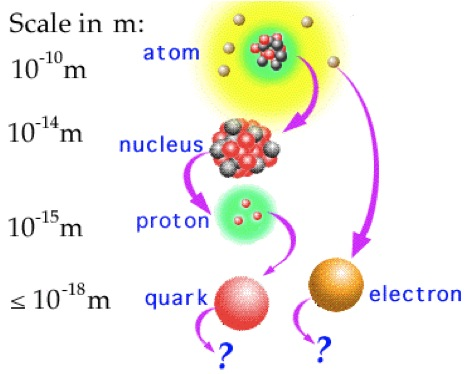
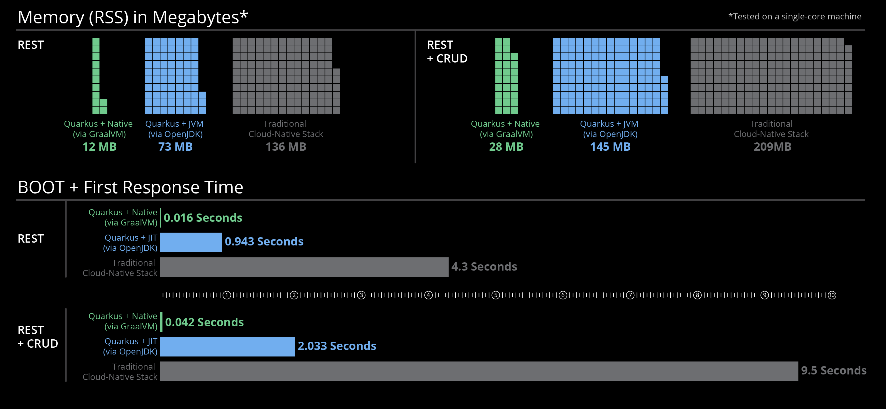
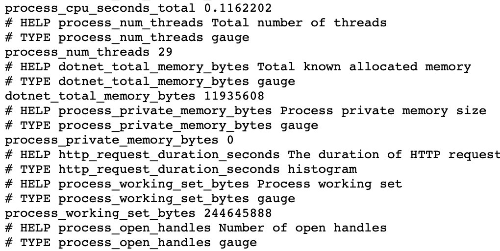

# Van microservices naar Quarkus

Door: Yael Bakker - [me@yael.fyi](mailto:me@yael.fyi)

[](https://github.com/Naereen?tab=followers)

Wij als ontwikkelaars vragen ons natuurlijk altijd af: kan het nóg efficiënter? (hoe minder werk we zelf hebben, hoe beter: automate everything!)

Zoals agile begin 2001 op kwam in het methodiekenlandschap (Kooijman, 2016), zo kwamen devops en microservices de afgelopen jaren op in de hands-on kant van ons vakgebied. Dit is allemaal leuk en aardig, maar: kan het nóg leaner?

TLDR; dat kan! Lees snel verder >>

> Als we een ander vakgebied bekijken, de natuurkunde, zie je over de loop der jaren ook steeds nieuwe ontdekkingen van groot tot letterlijk en figuurlijk heel klein. Waar in 1900, ver voordat software development in huidige vorm bestond, Prof. J.J. Thomson al schreef over 'bodies smaller than atoms' (Thomson, 1901) Gaat het momenteel o.a. over Quarks. Zonder op irrelevante details in te gaan: dit zijn deeltjes nóg kleiner dan atomen. Als het ware, de bouwstenen ván.



Zoals hierboven staat afgebeeld, vormen deze 'quarks', als het ware de bouwstenen van atomen. Quarkus doet net zo iets, maar biedt meerdere van dit soort 'bouwstenen' aan in de vorm van panklare dependencies en beproefde design patterns.

Concreet betekent dit dat je met Quarkus allerlei soorten applicaties, redelijk makkelijk kunt realiseren: voor vrijwel alles zijn plugins (verzamelingen van dependencies) beschikbaar, welke in `pom.xml` (maven), of `build.gradle` (gradle) geïncludeerd kunnen worden. Enkele voorbeelden hiervan zijn:

- quarkus-resteasy-jackson (voor REST JSON applicaties)
- quarkus-hibernate-orm-panache (voor data(base) centered applicaties)
- quarkus-grpc (voor gRPC applicaties)

Deze dependencies zijn rechtstreeks te verkrijgen op [mvnrepository.org](https://mvnrepository.com/artifact/io.quarkus). Dit zijn verzamelingen van bestaande projecten, met hier en daar wat optimisaties voor containerized toepassingen, geheugengebruik, e.d. (daar moet je ongeveer aan denken). Je kunt de ontwikkeling van Quarkus dan ook live volgen (of hieraan bijdragen) op [github](https://github.com/quarkusio/quarkus).

Tevens levert Quarkus een maven ([mvnw](https://github.com/takari/maven-wrapper)) of respectievelijk gradle ([gradlew](https://docs.gradle.org/current/userguide/gradle_wrapper.html)) wrapper mee (bij het aanmaken van een), waarmee dit soort acties via de command line geautomatiseerd kunnen worden. Je kunt dan bijvoorbeeld zeggen: `./mvnw package`, in plaats van `mvn package`. De wrappers hebben het voornaamste voordeel dat ze de mogelijkheid bevatten build-tools te installeren als die nog niet op het systeem staan (handig in CI/CD omgevingen).

Hoe dit nu allemaal in zijn werk gaat, wat de voordelen hiervan zijn én hoe je dit implementeert lees je in deze blogpost. Tevens geef ik je een aantal korte handvatten om zelf aan de slag te gaan met Quarkus in jouw project. Dit is een aanvulling op bestaande, [officiële handleidingen](https://quarkus.io/guides/getting-started). (QuarkusIO, 2021)

## Wat is Quarkus?

Quarkus is een framework, dat niet zozeer 'nieuwe' dingen doet, maar eerder bestaande dingen bij elkaar zet in een mooi jasje. Het doel? Java aantrekkelijker maken in de huidige docker-k8s cultuur, tenminste, als we de eigen [website](quarkus.io) mogen geloven.

De voordelen die Quarkus biedt, zijn dan ook voornamelijk geënt op moderne, containerized omgevingen (zo'n micro-services-architectuur bijvoorbeeld). Gebruik je deze niet? Geen probleem: dan kun je nog steeds gebruik maken (en voordeel hebben) van de meeste features van Quarkus.

Om terug te komen op deze 'containerized' omgevingen: Quarkus levert kant-en-klare Docker images, waarmee via de ingebouwde build tool (mvnw) direct voor Docker gebouwd kan worden. In plaats van een .jar, rolt er dan een aantrapbare docker container uit.

Om het nog een stapje verder te nemen, biedt Quarkus ook ondersteuning voor Kubernetes: in plaats van een aantrapbare docker container, kan de build tool eerst een docker image bouwen, deze naar een registry pushen, en vervolgens rolt er een direct bruikbare k8s config uit. Is dat even handig!

Tenslotte is ook nog instelbaar dat dit automatisch gedeployed wordt op een k8s cluster naar keuze: hoeven we dan niets meer zelf te doen?

## De voordelen van Quarkus

Quarkus adverteert met razendsnelle opstarttijden, laag geheugengebruik, near-instant scaling en AOT (Ahead Of Time) compilatie. Dit is relevant, omdat gangbare java JIT (Just In Time) compilatie gebruikt.

De meeste, geadverteerde performance winsten van Quarkus, zijn alleen bereikbaar als je gebruik maakt van z.g.h. native compilatie. Dit wil zeggen dat je wel java code schrijft, maar bij het uitvoeren van je programmaatje, geen gebruik maakt van een jre (java runtime environment). Dit is mogelijk, met behulp van [GraalVM](https://www.graalvm.org/). Hier komt dan uit je build bijvoorbeeld een x86_64 executable, i.p.v. een .jar.

Een ander voordeel, wat ik als gebruiker van Quarkus direct merk, is dat er moeite is gedaan de 'user experience' (voor developers dus) zo vloeiend mogelijk te maken. Dit is belangrijk, want lang niet alle (in mijn ervaring goede) frameworks zijn zo makkelijk te gebruiken, goed gedocumenteerd en actief als Quarkus.

Om terug te komen op die performance winst: als we de eigen [site](https://quarkus.io) mogen geloven, zou gebruik van Quarkus zelfs meer dan 50% geheugenwinst, en meer dan 75% snellere opstarttijden op moeten leveren:



Dat stellen we zometeen graag zelf aan de kaak, a.d.h.v. een voorbeeldcasus.

## Quarkus in de praktijk

Genoeg blabla, tijd voor wat praktische voorbeelden!

> Voor dit voorbeeld maak ik o.a. gebruik van [PitStop](https://github.com/edwinVW/pitstop). Een voorbeeldcasus van [InfoSupport](https://github.com/edwinVW/pitstop). Deze code-along is gebaseerd op bestaande guides die vrij beschikbaar zijn op [quarkus.io](https://quarkus.io/guides/).

### Aan de slag met Quarkus

Om een simpel project te starten (gebaseerd op Maven):

```sh
mvn io.quarkus.platform:quarkus-maven-plugin:2.3.0.Final:create \
    -DprojectGroupId=org.acme \
    -DprojectArtifactId=rest-json-quickstart \
    -DclassName="org.acme.rest.json.CustomerResource" \
    -Dpath="/customers" \
    -Dextensions="resteasy-jackson"
cd rest-json-quickstart
```

Deze applicatie start je vervolgens op met behulp van het `mvnw` script:

```sh
 ./mvnw compile quarkus:dev
```

### CustomerManagementAPI

Een van de services in de PitStop applicatie, is `CustomerManagementAPI`.

Als we het abstract bekijken, is `CustomerManagementAPI` slechts een microservice met 3 voornaamste functionaliteiten:

- REST API voor GET & POST /customers(/\<id\>)
- RabbitMQ aansluiting voor notificaties andere servies in de PitStop applicatie.
- Databeheer (authority) van 'Customers'

### CustomerManagementAPI in Quarkus

Om de scope van dit artikel beknopt te houden, houden we het voor nu even bij de eerste (en laatste als je in-memory data mee-telt) functionaliteit in bovenstaande lijstje.

Ten eerste een simpele, doch identieke `Customer` entity:

```java
public class Customer {
    public String customerId;
    public String name;
    public String address;
    public String postalCode;
    public String city;
    public String telephoneNumber;
    public String emailAddress;

    public Customer() {
    }

    public Customer(String customerId, String name, String address, String postalCode, String city, String telephoneNumber, String emailAddress) {
        this.customerId = customerId;
        this.name = name;
        this.address = address;
        this.postalCode = postalCode;
        this.city = city;
        this.telephoneNumber = telephoneNumber;
        this.emailAddress = emailAddress;
    }
}
```

Vervolgens een bijpassende `CustomerResource`:

```java
@Path("/customers")
public class CustomerResource {

    private Set<Customer> customers = Collections.newSetFromMap(Collections.synchronizedMap(new LinkedHashMap<>()));

    public CustomerResource() {}

    @GET
    public Response list() {
        return Response.ok(customers).build();
    }

    @POST
    public Response add(Customer customer) {
        try {
            customers.add(customer);
        } catch (Exception e) {
            return Response.serverError().build();
        }
        return Response.ok(customers).build();
    }
}
```

Om wat te zien als we `GET /customers` uit het endpoint opvragen voeg ik tot slot nog twee customers toe:

```java
public CustomerResource() {
        customers.add(new Customer("1", "Johnny", "hoofdstraat 1", "5361AX", "Amersfoort", "0612345678", "johnny@example.com"));
        customers.add(new Customer("2", "Miep", "hoofdstraat 1", "5361AX", "Amersfoort", "0612345678", "miep@example.com"));
    }
```

### Prometheus

Om de geadverteerde performance-winsten inzichtelijk te maken, kunnen we gebruik maken van Prometheus.

Voor het dotnet gedeelte van de applicatie (de originele `CustomerManagementAPI` van PitStop) is toevoegen van onderstaande code voldoende. Installeer wel eerst de [prometheus-net.AspNetCore](https://www.nuget.org/packages/prometheus-net.AspNetCore) nuget package.

Voegt dit toe aan `Startup.cs`

```c#
public void Configure(IApplicationBuilder app, ...)
        {
            ...
            app.UseRouting();
            app.UseHttpMetrics();
            app.UseEndpoints(endpoints =>
            {
                endpoints.MapMetrics();
            });
```

Voor de zojuist gemaakte Quarkus service is de volgende aanpak voldoende:

Installeer de `quarkus-micrometer-registry-prometheus` dependency door het volgende aan `pom.xml` toe te voegen:

```xml
<dependency>
      <groupId>io.quarkus</groupId>
      <artifactId>quarkus-micrometer-registry-prometheus</artifactId>
    </dependency>
```

Voeg vervolgens de volgende code toe aan `CustomerResource.java` (dependency injection):

```java
import io.micrometer.core.instrument.MeterRegistry;

@Path("/customers")
public class CustomerResource {

    @Inject
    MeterRegistry registry;
}

```

## Bevindingen

### Metingen

> Gebruik van resources op bestaande CustomerManagementAPI (Prometheus)



> Gebruik van resources op quarkus CustomerManagementAPI (Prometheus)


Response Tijden REST API calls:

| Request # | .net (ms) | quarkus (ms) |
| --------- | --------- | ------------ |
| 1         | 15.969    | 4.809        |
| 2         | 7.61      | 4.472        |
| 3         | 10.2515   | 25.8         |
| 4         | 17.019    | 10.6         |
| 5         | 52.588    | 7.62         |

Voor de mate van stabiliteit van deze metingen, kunnnen we snel even de standaarddeviatie (EduPristine, 2017) berekenen:


| .net (stddev, ms) | quarkus (stddev, ms) |
| ----------------- | -------------------- |
| 18.257            | 8.817                |

Lager = (in dit geval) stabieler.

Meer overtuiging heeft het niet nodig: quarkus is duidelijk sneller in dit geval.

\*\*Disclaimer: bovenstaande resultaten zijn onderhevig aan vele factoren, en dienen voornamelijk als anekdote over de beweerde perfomance winst van Quarkus. Werkelijk (reproduceerbaar) onderzoek is uiteraard beter opgezet (mag ik hopen).

### Containers

Voor de oplettende kijker: in onze werkmap, onder `/src/main/docker` staan ook enkele Dockerfiles met beschrijving. Deze zijn in principe klaar voor gebruik, en kunnen zo opgenomen wordden in een k8s of docker swarm omgeving.

Doe voordat je hier gebruik van maakt nog wel even: `./mvnw package`. Dit staat ook als commentaar in de Dockerfiles bijgevoegd en zou voor zich moeten spreken.

## En verder…

We hebben even kort gekeken naar Quarkus. Een microservices framework voor Java, met flinke claims betreft performance. Dit hebben we kort kunnen testen a.d.h.v. een voorbeeldapplicatie, waaruit bleek dat hier wel een kern van waarheid in zit.

Om dit zelf te ervaren, en meer te weten te komen over Quarkus, bevat de officiële documentatie vele guides die op, voor jou relevante, specifieke toepassingen in gaan.

Een (relevante) greep uit deze guides:

- [Generating Jax-RS resources with panache](https://quarkus.io/guides/rest-data-panache)
- [amqp](https://quarkus.io/guides/amqp)
- [deploying-to-kubernetes](https://quarkus.io/guides/deploying-to-kubernetes)

Verder is het volgende boek wellicht interessant (mochten boeken je ding zijn):

- Tayo Koleoso (August 26, 2020). Beginning Quarkus Framework: Build Cloud-Native Enterprise Java Applications and Microservices 1st Edition. Apress ISBN 1484260317.

## Bronnen

- Kooijman, B. (2021, 11 augustus). Wat is Agile? De betekenis van Agile werken. Agile Scrum Group. https://agilescrumgroup.nl/wat-is-agile/ Geraadpleegd op 7 oktober 2021.
- Thomson, J. J. & Smithsonian Institution. (1901). On Bodies Smaller Than Atoms. U.S. Government Printing Office. Geraadpleegd op 5 oktober 2021.
- Nordkvist. (2010). Scales of atoms to quarks [Illustratie]. http://portal.discoverthecosmos.eu/fi/node/93607[Attribution-NonCommercial-ShareAlike 3.0 Unported (CC BY-NC-SA 3.0)](https://creativecommons.org/licenses/by-nc-sa/3.0/) Geraadpleegd op 6 oktober 2021.
- Creating Your First Application. (z.d.). Quarkus.io. Geraadpleegd op 6 oktober 2021, van https://quarkus.io/guides/getting-started
- What is Standard Deviation and how is it important? (2018, 24 september). EduPristine. https://www.edupristine.com/blog/what-is-standard-deviation Geraadpleegd op 7 oktober 2021.

## Over de Auteur

Yael is een aankomend software developer aan de Hogeschool van Arnhem en Nijmegen. Verder heeft hij twee succesvolle bedrijfjes, en ruim 6 jaar aan relevante werkervaring in het vakgebied. In zijn vrije tijd is Yael vaak te vinden achter zijn espressomachine, waar hij krachtige shots espresso uit tovert, soms aangevuld met hippe melkschuimpatroontjes.


